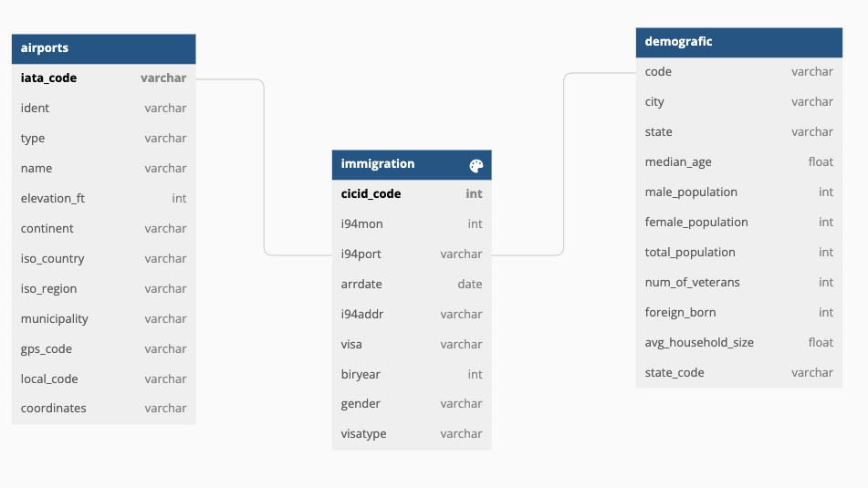

# Udacity Data Engineering Capstone Project.
This project creates a data lake for CIC immigration data. The pipeline extratcs data from S3, process it using Spark and loads data back to S3 as a set of parquete files. The idea of the final data is to allow business and data analysts to find insights about immigration to the US such popular immmigration locations and purpose.

# Data used in the ETL
- I94 Immigration Data: SAS file for each month of 2016. This data comes from US National Tourism and Trade Office, and the original source: https://travel.trade.gov/research/reports/i94/historical/2016.html
- U.S. City Demographic Data: CSV file with information on US City demographics: population -male, female, median income etc. Source: https://public.opendatasoft.com/explore/dataset/us-cities-demographics/export/
- Airport Code Table: CSV file with table of airport codes and corresponding cities source: https://datahub.io/core/airport-codes#data
- IATA data: CSV file, lookup to get IATA code to airport name, city, state Source: https://www.airportcodes.us/us-airports.htm

# Output Data and Data Model
This project is designed as a star schema with 1 fact and multiple dimensonal tables.
The pipeline processes data mentioned above and loads it into a data lake on S3 server as a set of parquete files. The end solution includes 3 parquete files:

- Fact Table. Immigration
    Contains transactional data where each transaction is an event of one person arriving to the US. Maps to other tables via IATA codes (i94port field)
- Dimension Table #1: Airports.
    Airport data including airport exact coordinates, description, IATA code, city, name, etc. Can be mapped to the fact table via iata_code
- Dimension Table #2: Demografic.
    Info about US cities. This table joins demografic data with IATA codes (iata data source). Demografic table contains city name, city population, median age, etc. it alllows to understand what locations are more popular among immigrants.

# Files
- data_test - Data samples used in the project if S3 access is not granted
- capstone_etl.ipynb - Test scripts with ETL steps description 
- capstone_etl.py - Main file that launches the ETL pipeline
- conf.cfg - File with credentials 
- Output data samples - sample of the ETL output data. (Just an example)
    
    
# How to run the pipeline
- Start an EMR cluster on AWS
- Upload the capstone_etl.py to the EMR cluster Master Node
- Submit the file using a command /usr/bin/spark-submit --master yarn ./capstone_etl.py